```mermaid
%%{init: {'theme':'dark', 'themeVariables': { 'primaryColor': '#00D4FF', 'primaryTextColor': '#FFFFFF', 'primaryBorderColor': '#7C3AED', 'lineColor': '#00D4FF', 'secondaryColor': '#7C3AED', 'tertiaryColor': '#FF6B6B', 'background': '#0D1117', 'mainBkg': '#161B22', 'secondBkg': '#21262D'}}}%%
flowchart TD
    A[🎓 Fresh CSE Graduate] --> B[💻 MERN Stack Master]
    B --> C[🔗 Blockchain Explorer]
    C --> D[🤖 AI Enthusiast]
    D --> E[🌟 Full Stack Engineer]
    E --> F[🚀 Tech Innovator]
    
    classDef startNode fill:#00D4FF,stroke:#FFFFFF,stroke-width:2px,color:#000000
    classDef processNode fill:#7C3AED,stroke:#FFFFFF,stroke-width:2px,color:#FFFFFF
    classDef endNode fill:#FF6B6B,stroke:#FFFFFF,stroke-width:2px,color:#FFFFFF
    
    class A startNode
    class B,C,D,E processNode
    class F endNode
```

# <div align="center">🚀 **SHAN'S CODE UNIVERSE** 🚀</div>

<div align="center">
  
</div>

<div align="center">
  
  
  
</div>

---

## <div align="center">🎯 **MISSION STATEMENT** 🎯</div>

<div align="center">
  
  
  
  
  
  ### 💡 *"Fresh graduate with a hunger for code and a vision for innovation"*
  
</div>

---

## <div align="center">🛠️ **TECH ARSENAL** 🛠️</div>

<div align="center">

### 🔥 **CORE STRENGTH: MERN STACK** 🔥
*This is where I dominate*

</div>

<table align="center">
<tr>
<td width="50%" align="center">

### 🎨 **FRONTEND MASTERY**


```javascript
const frontend = {
  expert: ["React.js", "Next.js", "JavaScript"],
  styling: ["Tailwind CSS", "Bootstrap", "Material UI"],
  ui: ["Aceternity UI"],
  focus: "Beautiful User Experiences"
};
```

</td>
<td width="50%" align="center">

### ⚡ **BACKEND POWER**


```javascript
const backend = {
  runtime: "Node.js",
  framework: "Express.js", 
  database: "MongoDB",
  cloud: "Firebase",
  apis: "REST APIs & JWT"
};
```

</td>
</tr>
</table>

---

## <div align="center">📊 **SKILL LEVELS** 📊</div>

<div align="center">

| **Technology** | **Proficiency** | **Experience** |
|:---:|:---:|:---:|
| **JavaScript/TypeScript** | `████████░░` | `85%` |
| **React.js** | `████████░░` | `80%` |
| **Node.js/Express** | `███████░░░` | `75%` |
| **MongoDB** | `███████░░░` | `70%` |
| **Next.js** | `██████░░░░` | `65%` |
| **Blockchain** | `███░░░░░░░` | `30%` |
| **AI/LLM** | `██░░░░░░░░` | `25%` |

</div>

---

## <div align="center">🌟 **EXPLORING NEW FRONTIERS** 🌟</div>

<div align="center">


</div>

<table align="center">
<tr>
<td width="50%" align="center">

### ⛓️ **BLOCKCHAIN JOURNEY**
```solidity
contract Learning {
    string public platform = "Ethereum";
    string[] public tools = ["Ethers.js", "IPFS"];
    string public status = "Exploring";
    
    function getMotivation() public pure returns (string) {
        return "Decentralizing the future!";
    }
}
```

</td>
<td width="50%" align="center">

### 🤖 **AI EXPLORATION**
```python
class AIExplorer:
    def __init__(self):
        self.frameworks = ["Langchain", "Langgraph"]
        self.focus = "LLM Integration"
        self.status = "Curious Learner"
    
    def goal(self):
        return "Building intelligent applications"
```

</td>
</tr>
</table>

---

## <div align="center">🎯 **DEVELOPMENT TOOLS** 🎯</div>

<div align="center">
  
  
  
  | **Category** | **Tools** |
  |:---:|:---:|
  | **Version Control** | Git, GitHub |
  | **API Testing** | Postman |
  | **Deployment** | Vercel, Netlify, Render |
  | **Languages** | JavaScript, TypeScript, Python, C/C++, Solidity |
  
</div>

---

## <div align="center">📈 **GITHUB ANALYTICS** 📈</div>

<div align="center">


<br/>


<br/>


</div>

---

## <div align="center">🚀 **CURRENT LEARNING PATH** 🚀</div>

<div align="center">



</div>

---

## <div align="center">💪 **SUPERPOWERS** 💪</div>

<div align="center">

<table>
<tr>
<td width="25%" align="center">

### 🧠 **PROBLEM SOLVING**
*Lightning-fast logical thinking*

</td>
<td width="25%" align="center">

### ⚡ **BIAS FOR ACTION**
*I don't just plan, I execute*

</td>
<td width="25%" align="center">

### 🤝 **TEAM COLLABORATION**
*Better together than alone*

</td>
<td width="25%" align="center">

### 🔥 **CONTINUOUS LEARNING**
*Always hungry for knowledge*

</td>
</tr>
</table>

</div>

---

## <div align="center">🎨 **FEATURED PROJECTS** 🎨</div>

<div align="center">

### 🌐 **Check out my portfolio:** [shansphere.vercel.app](https://shansphere.vercel.app)

<table>
<tr>
<td width="33%" align="center">

### 🔥 **MERN Applications**
- Full-stack web apps
- Real-time features  
- Modern UI/UX
- Database integration

</td>
<td width="33%" align="center">

### 🤖 **AI Experiments**
- LLM integrations
- Intelligent chatbots
- AI-powered features
- Langchain implementations

</td>
<td width="33%" align="center">

### ⛓️ **Blockchain Prototypes**
- Smart contracts
- DApp interfaces
- Ethereum integration
- IPFS implementations

</td>
</tr>
</table>

</div>

---

## <div align="center">🎯 **2024 ROADMAP** 🎯</div>

<div align="center">

```
🟢 Q1: Advanced React Patterns & Next.js 14
🟡 Q2: Full-Stack MERN Projects & Authentication
🔵 Q3: Blockchain Fundamentals & Smart Contracts  
🟣 Q4: AI Integration & Production Deployment
```

</div>

---

## <div align="center">💻 **CODE PHILOSOPHY** 💻</div>

<div align="center">

```typescript
interface Developer {
  name: string;
  mindset: string;
  passion: string[];
  goal: string;
}

const shan: Developer = {
  name: "Shan",
  mindset: "Growth-oriented & Solution-focused",
  passion: ["Clean Code", "User Experience", "Innovation"],
  goal: "Building impactful solutions that matter"
};

// My approach to development
const approach = {
  code: "Write code that tells a story",
  product: "Build solutions that solve real problems",
  growth: "Never stop learning and evolving",
  collaboration: "Innovate together, achieve more"
};
```

</div>

---

## <div align="center">🌐 **LET'S CONNECT** 🌐</div>

<div align="center">

<a href="https://shansphere.vercel.app">
  
</a>
<a href="mailto:your.email@example.com">
  
</a>
<a href="https://linkedin.com/in/your-profile">
  
</a>

</div>

---

## <div align="center">🎯 **CURRENTLY SEEKING** 🎯</div>

<div align="center">

```
🎯 Looking for: Entry-level Full Stack Developer positions
🌟 Interested in: Startups, Tech companies, Remote opportunities
💡 Excited about: MERN projects, AI integration, Web3 exploration
🤝 Available for: Collaborations, Open source contributions, Learning partnerships
```

</div>

---

<div align="center">
  
  
  
  
  
  ### ⭐ **If you found this interesting, consider giving it a star!** ⭐
  
  <sub>Built with ❤️ by a passionate software engineer in the making</sub>
  
</div>
