# 🚀 Welcome to My Digital Universe

<div align="center">
  
</div>

<div align="center">
  
  ```ascii
  ╔═══════════════════════════════════════════════════════════════╗
  ║                    🌟 SHAN'S CODE LABORATORY 🌟               ║
  ║                                                               ║
  ║  "Every expert was once a beginner. Every pro was once an    ║
  ║   amateur. Every icon was once an unknown."                  ║
  ║                                                               ║
  ╚═══════════════════════════════════════════════════════════════╝
  ```
  
</div>

---

## 🎯 Current Mission: Building the Future, One Line at a Time

<div align="center">
  
  ### 🏗️ Engineering Status: **UNDER CONSTRUCTION** 🏗️
  
  
  
  
  
</div>

---

## 🌟 The Journey Map

```mermaid
graph TD
    A[🎓 Fresh CSE Graduate] --> B[💻 MERN Stack Foundation]
    B --> C[🔗 Blockchain Explorer]
    C --> D[🤖 AI/LLM Enthusiast]
    D --> E[🚀 Full Stack Engineer]
    E --> F[🌟 Tech Innovator]
    
    style A fill:#FFD700
    style B fill:#00D8FF
    style C fill:#FF6B6B
    style D fill:#4ECDC4
    style E fill:#45B7D1
    style F fill:#96CEB4
```



---

## 🛠️ Tech Arsenal

<div align="center">

### 🎯 **Core Strength: MERN Stack** 
*Where I shine brightest*

</div>

<table>
<tr>
<td width="50%">

#### 🎨 **Frontend Mastery**
```javascript
const frontendSkills = {
  frameworks: ["React.js", "Next.js"],
  stateManagement: ["Redux"],
  styling: ["Tailwind CSS", "Bootstrap", "Material UI"],
  uiLibraries: ["Aceternity UI"],
  passion: "Creating beautiful user experiences"
};
```

#### 🔧 **Backend Power**
```javascript
const backendSkills = {
  runtime: "Node.js",
  framework: "Express.js",
  database: "MongoDB",
  cloud: "Firebase",
  apis: "REST APIs",
  auth: "JWT",
  pythonFramework: "FastAPI"
};
```

</td>
<td width="50%">

#### 🌟 **Exploring New Horizons**
```javascript
const exploringTech = {
  blockchain: {
    platform: "Ethereum",
    tools: ["Ethers.js", "IPFS"],
    language: "Solidity",
    status: "Learning & Experimenting"
  },
  ai: {
    frameworks: ["Langchain", "Langgraph"],
    focus: "LLM Integration",
    status: "Curious Explorer"
  },
  languages: ["JavaScript", "TypeScript", "Python", "C/C++"]
};
```

</td>
</tr>
</table>

---

## 📊 Skill Progression Dashboard

<div align="center">

### 🏆 **Expertise Levels**

| Technology | Proficiency | Experience Bar |
|------------|-------------|----------------|
| **JavaScript/TypeScript** | Advanced | ████████░░ 80% |
| **React.js** | Advanced | ████████░░ 85% |
| **Node.js/Express** | Intermediate+ | ███████░░░ 75% |
| **MongoDB** | Intermediate+ | ███████░░░ 70% |
| **Next.js** | Intermediate | ██████░░░░ 65% |
| **Blockchain** | Beginner+ | ███░░░░░░░ 30% |
| **LLM/AI** | Beginner+ | ███░░░░░░░ 25% |

</div>

---

## 🎨 Featured Projects Showcase

<div align="center">

### 🌟 **Portfolio Highlights**
*Check out my work at: [shansphere.vercel.app](https://shansphere.vercel.app)*

</div>

<table>
<tr>
<td width="33%">

#### 🔥 **MERN Applications**
- Full-stack web applications
- Real-time features
- Modern UI/UX design
- Database integration

</td>
<td width="33%">

#### 🤖 **AI Experiments**
- LLM integrations
- Langchain implementations
- Intelligent chatbots
- AI-powered features

</td>
<td width="33%">

#### ⛓️ **Blockchain Prototypes**
- Smart contracts
- DApp interfaces
- Ethereum integration
- IPFS implementations

</td>
</tr>
</table>

---

## 🌟 What Makes Me Unique

<div align="center">

```
┌─────────────────────────────────────────────────────────────────┐
│                        🎯 MY SUPERPOWERS                        │
├─────────────────────────────────────────────────────────────────┤
│                                                                 │
│  🧠 Problem Solving     │  Lightning-fast logical thinking      │
│  ⚡ Bias for Action     │  I don't just plan, I execute         │
│  🤝 Team Collaboration │  Better together than alone           │
│  🔥 Continuous Learning │  Always hungry for new knowledge      │
│  💡 Innovation Mindset  │  Turning ideas into reality          │
│                                                                 │
└─────────────────────────────────────────────────────────────────┘
```

</div>

---

## 📈 GitHub Stats & Activity

<div align="center">


### 🔥 **Contribution Streak**


### 🏆 **Achievement Trophies**


</div>

---

## 🎯 Current Learning Sprint

<div align="center">

### 🚀 **2024 Roadmap**

</div>


---

## 🎨 Code Philosophy

<div align="center">

```typescript
class SoftwareEngineerInMaking {
  private mindset: string = "Growth-oriented";
  private passion: string[] = ["Clean Code", "User Experience", "Innovation"];
  private goal: string = "Building impactful solutions";
  
  public approach(): string {
    return `
      🔥 Write code that tells a story
      🌟 Build products that solve real problems  
      🚀 Never stop learning and growing
      💡 Collaborate, innovate, and inspire
    `;
  }
  
  public currentFocus(): string {
    return "Mastering MERN stack while exploring the frontiers of Web3 and AI";
  }
}

const shan = new SoftwareEngineerInMaking();
```

</div>

---

## 🌐 Connect & Collaborate

<div align="center">

### 🤝 **Let's Build Something Amazing Together!**

<a href="https://shansphere.vercel.app">
  
</a>
<a href="mailto:your.email@example.com">
  
</a>
<a href="https://linkedin.com/in/your-profile">
  
</a>

---

### 💬 **Open to Opportunities**

```
🎯 Seeking: Entry-level Full Stack Developer roles
🌟 Interested in: Startups, Tech companies, Remote work
💡 Excited about: MERN projects, AI integration, Blockchain experiments
🤝 Available for: Collaboration, Open source contributions, Learning partnerships
```

---

<div align="center">
  
  ### 🌟 **Thank you for visiting my digital space!** 🌟
  
  
  
  ---
  
  **⭐ If you found this interesting, consider giving it a star!**
  
  <sub>Built with ❤️ by a passionate software engineer in the making</sub>
  
</div>

---

<div align="center">
  
</div>
